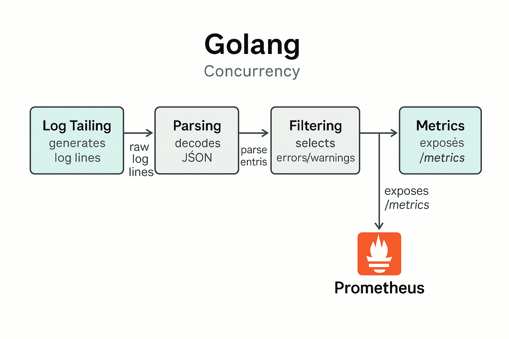

# 🚀 Go Log Metrics Pipeline

A Go project demonstrating concurrency patterns using a log processing pipeline that emits Prometheus metrics.

---

## 🔧 Features

- 🧵 Go channels & goroutines (pipeline concurrency pattern)
- 🪵 Simulated log streaming (or replace with Kafka/file)
- 📦 JSON parsing + filtering (e.g., by log level)
- 📊 Prometheus metrics export (`/metrics`)
- 🛠 Makefile for easy local dev
- 🐳 Docker Compose setup for Prometheus + Grafana

---

## ▶️ Getting Started

### 1. Install Dependencies

```bash
go mod tidy
```

### 2. Run the App

```bash
make run
```

Visit: [http://localhost:2112/metrics](http://localhost:2112/metrics)

---

### 3. Start Prometheus + Grafana (Optional)

```bash
make prometheus-up
```

- Prometheus: [http://localhost:9090](http://localhost:9090)
- Grafana: [http://localhost:3000](http://localhost:3000) (admin/admin)

---

### 4. Stop Monitoring Stack

```bash
make prometheus-down
```

---

## 🧭 Architecture Diagram

This project uses a concurrency pipeline in Golang to process logs and expose metrics via Prometheus.



---

## ✅ How to Verify the Project

Follow these steps to ensure the log processing pipeline and metrics are working correctly:

### 1. Run the Go Application

```bash
make run
```

You should see:

```
Prometheus metrics exposed on :2112/metrics
```

### 2. Open the Metrics Endpoint

Visit: http://localhost:2112/metrics

You should see:

```
log_entries_total{level="error"} <some number>
```

### 3. Watch the Metrics Update

Refresh every few seconds. The counter will increase as more logs are processed.

### 4. (Optional) Launch Prometheus + Grafana

```bash
make prometheus-up
```

- Prometheus: http://localhost:9090 (query: `log_entries_total`)
- Grafana: http://localhost:3000 (admin/admin)

### 5. (Optional) Debug Log Flow Internally

Use `fmt.Println(...)` in:

- `tailer.go` → log emitted
- `parser.go` → log parsed
- `filter.go` → log passed

### 6. Stop All

```bash
make prometheus-down
```

---

## 🧠 Learn Go Concurrency: The Pipeline Pattern

This project demonstrates the **pipeline concurrency pattern**, one of the most powerful and idiomatic patterns in Go for streaming data processing.

### 🧩 What is the Pipeline Pattern?

In Go, a pipeline is a series of **stages** connected by **channels**, where each stage runs in its own **goroutine** and performs a transformation or action on the data.

```
┌────────┐   ┌────────┐   ┌────────┐   ┌────────────┐
│ Tailer │ → │ Parser │ → │ Filter │ → │ Prometheus │
└────────┘   └────────┘   └────────┘   └────────────┘
    log        JSON         error         metrics
  strings      logs          only          exposed
```

Each stage is fully concurrent and communicates via channels.

---

### 💡 Why Use It?

✅ **Decoupling:** Each stage does one thing — easy to test, debug, and extend  
✅ **Scalability:** Each stage runs independently and can be scaled if needed  
✅ **Streaming:** Perfect for handling unbounded streams of data (like logs)  
✅ **Backpressure Friendly:** Naturally supports blocking when downstream is slow  
✅ **CPU Efficiency:** Leverages goroutines, not OS threads — lightweight & fast

---

### 👨‍💻 Where It's Used in This Project

| Stage     | Description                          |
|-----------|--------------------------------------|
| `tailer`  | Emits new log lines periodically     |
| `parser`  | Parses JSON strings into objects     |
| `filter`  | Filters logs by level (`error`, etc.)|
| `metrics` | Counts and exports metrics           |

---

## 📚 License

MIT
